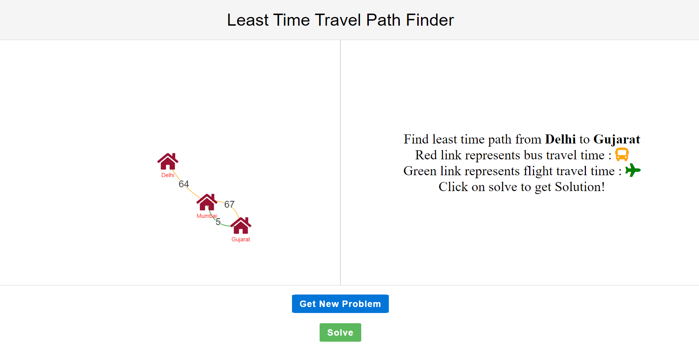
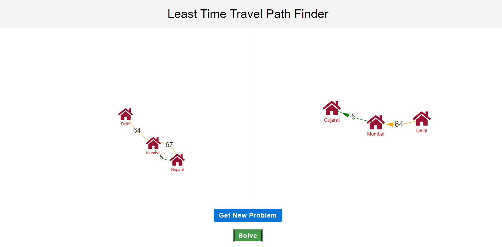

## Track here: https://path-finder-v1.netlify.app/
# TravelPathFinder

Travel Path Finder Web App Using javascript. you can access by git clone in your terminal and open index.html file

## Application overview

## Application OUTPUT

## Maintainers

#### This repo is maintained by [VIKASH RAHII](https://github.com/Vikash-rahii-au7).
